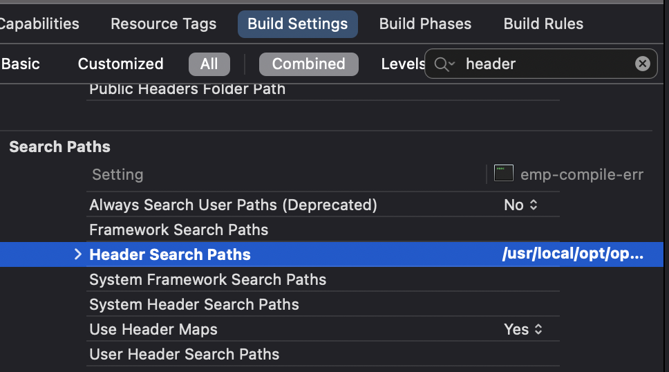
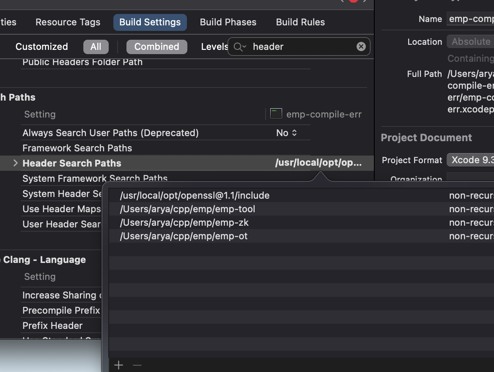
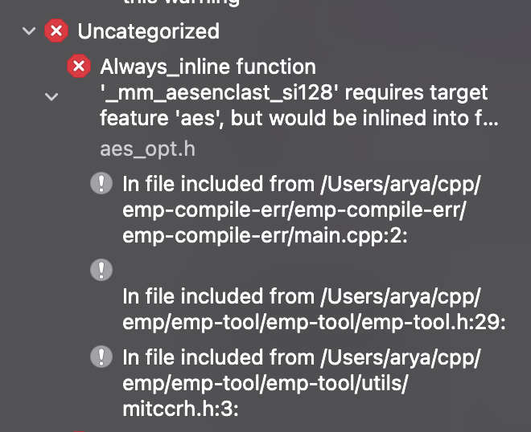

Steps to reproduce the error:

1. Clone the repository.
2. Open the project `emp-compile-err.xcodeproj`.
3. Fix the include paths to reflect where OpenSSL and EMP-Kit are installed on your machine. The steps for doing so are described [here](https://stackoverflow.com/a/35930656/5116581).

4. Attempt to run the project and get the following 3 errors:

`emp-tool/utils/aes_opt.h:12:15: Always_inline function '_mm_aesenclast_si128' requires target feature 'aes', but would be inlined into function 'ks_rounds' that is compiled without support for 'aes'`

`emp-tool/utils/aes_opt.h:79:13: Always_inline function '_mm_aesenc_si128' requires target feature 'aes', but would be inlined into function 'ParaEnc' that is compiled without support for 'aes'`

`emp-tool/utils/aes_opt.h:89:12: Always_inline function '_mm_aesenclast_si128' requires target feature 'aes', but would be inlined into function 'ParaEnc' that is compiled without support for 'aes'`

